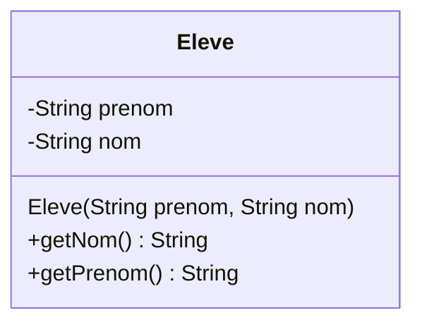
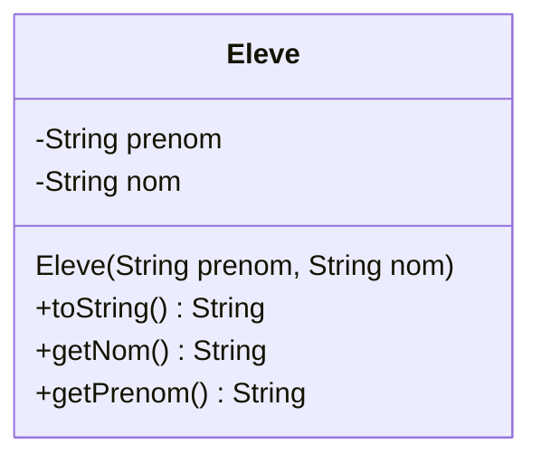
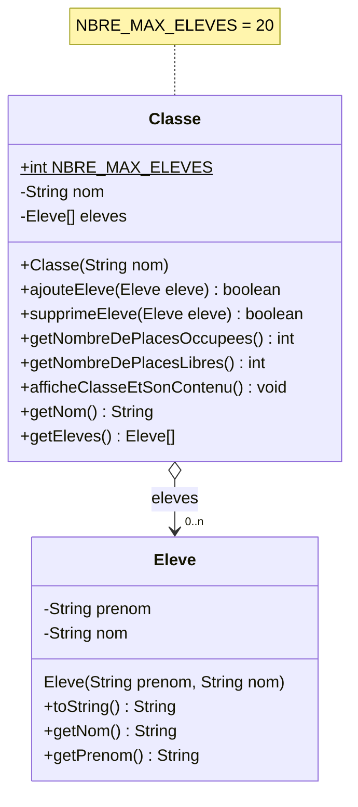

# Exercice 02 : Eleves
## Durée : 105'
## Objectifs visés :
- Implémentation d’une classe simple
- Création et utilisation d‘objets stockés dans un tableau
- Création de votre première association entre classe
## PARTIE 1 : Créer votre classe qui modélisera un élève
Dans ce projet vous allez créer une classe Java qui représentera **un élève**.

Dans ce projet créez une classe modélisant un `Eleve`. Un `Eleve` aura comme attributs un nom et un prénom et seulement des getters. Basez-vous sur le diagramme de classe pour les informations manquantes.


Au dessus du `main()`, créez une constante `NBRE_MAX_ELEVES` de valeur `20`. Celle-ci représente la taille maximale d'une classe d'élèves.

Dans votre `main()`, déclarez une variable `eleves` permettant de contenir `NBRE_MAX_ELEVES` objets de type `Eleve`. Créez ensuite cette structure de données.

Créez ensuite 5 objets différents de type `Eleve`. Placez ces élèves dans les 4 premières cases de votre tableau, laissez les deux emplacements suivants vides et placez ensuite le dernier élève.

Dans une boucle, parcourez l'ensemble de votre tableau à la recherche d'élèves et , lorsque vous en trouvez un, affichez-le sur la console de la manière suivante :
```
L'élève N°0 s'apelle => James Cameron
L'élève N°1 s'appelle => Mac Haroni
L'élève N°2 s'appelle => John D'Oeuf
L'élève N°3 s'appelle => Alex Terrieur
L'élève N°6 s'appelle => Alain Terrieur
```
## Partie 2 : Affichage de la classe par elle même
Rendez plus intelligente votre classe `Eleve` en apprenant à ses objets à s’afficher eux-mêmes de manière lisible et compréhensible.

On va faire en sorte qu’un `sout( unEleve );` affiche automatiquement son prénom et son nom séparé par un espace.

Surchargez la méthode `toString()` de votre classe Eleve pour faire ceci. Adaptez votre programme principal dans le main() pour en tirer profit.

## Partie 3 : Implémentation de la notion de "classe d'élève"
Créez une nouvelle classe qui représentera la notion de « classe d’élèves » que vous nommerez `Classe`. Vous trouvez tous les détails du contenu de cette classe ci-dessous, dans son diagramme de classe.



Pour l’implémentation des méthodes de cette classe observez attentivement leurs signatures. Cela vous guidera efficacement sur ce qu’elles doivent faire (bien choisir les noms de méthodes et d’attribut est crucial !).
Pour les méthodes qui pourraient voir leur travail échouer elles retournent un booléen indiquant si ça s’est bien passé (**true**) ou mal passé (**false**). 
Dans le doute, demandez au prof, il vous guidera avec plaisir.

Dans le `main()` de votre programme principal, commencez par créer une nouvelle ´Classe´ qui représentera les élèves de la classe **"30021X"**.
Créer ensuite 5 élèves différents et rajoutez les à votre classe à l'aide de sa méthode adéquate. Pour terminer, affichez le contenu de la classe en appelant sa méthode adéquate.

## Partie 4 : Affichage plus intelligent de la classe
Rendez votre classe Classe plus intelligente en codant plus adéquatement sa méthode `getEleves()`.

En effet, il n’est ni utile ni pratique de retourner à l’utilisateur notre tableau d’élèves tel quel, car il est fort probable que celui-ci contienne des cases « vides », c-à-d ne contenant PAS d’élèves (**null**).
Pourquoi embarrasser l’utilisateur avec un tel résultat ? Lui donner un tableau de taille 20 alors qu’il n’y a que 3 élèves dedans ???

En clair, plutôt que de lui rendre un tableau ressemblant à ceci :
| 0 | 1 | 2 | 3 | 4 | 5 | 6 | 7 | 8 | 9 |
| :----: | :----: | :----: | :----: | :----: | :----: | :----: | :----: | :----: | :----: |
| Jean | `null` | Paul | `null` | `null` | Simon | `null` | `null` | François | `null` |

Il est bien plus pratique et logique pour celui qui appellera cette méthode  `getEleves()` de recevoir ce tableau :
| 0 | 1 | 2 | 3 |
| :----: | :----: | :----: | :----: |
| Jean | Paul | Simon | François |

Il faut donc retourner une liste **ne contenant QUE** les élèves réellement présents et rien d’autre.

Modifiez la méthode `getEleves()` en conséquence puis testez depuis votre `main()` en appelant cette méthode et en affichant les objets retournés **sans vérifier la présence d’objets** (si vous ne comprenez pas le sens exact de cette partie en gras c'est que quelque-chose d'important dans ce module est en train de vous échapper ! N'attendez pas pour clarifier cela !).
